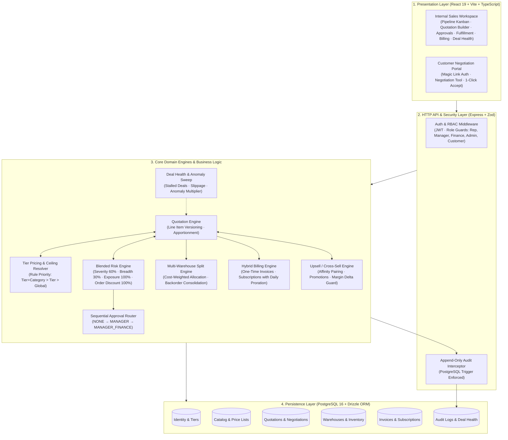
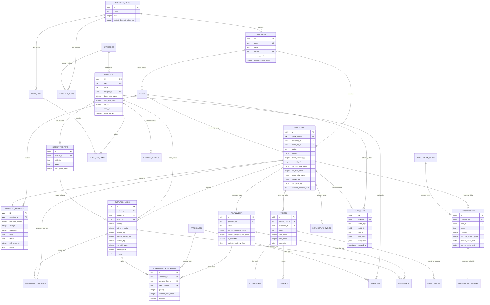
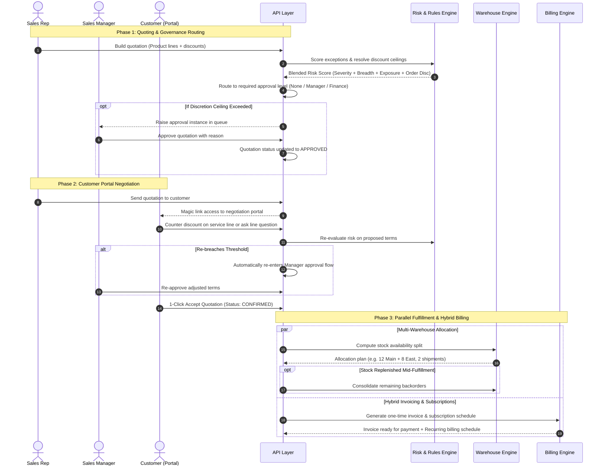

# DealFlow360 — Architecture & Data Model

> **Deliverable**: One-page architecture diagram showing the data model and how the major modules connect (Problem Statement §8).

---

## 1. System Module Connectivity Architecture

---

## 2. Complete Data Model (Entity Relationship Diagram)

---

## 3. Module Interaction & Lifecycle Sequence

---

## 4. Key Architectural Invariants

1. **Integer Money (Paise) & Basis Points (bp)**: Zero floating-point arithmetic is permitted. Rates and discounts are integer basis points ($1\% = 100\text{ bp}$).
2. **Ceiling Snapshots**: When a line is added, its resolved discount ceiling is snapshotted to `quotation_lines.effective_ceiling_bp`. Changing rules later never rewrites past contracts.
3. **Portal Isolation**: Portal responses strip all confidential internals (`costAmountPaise`, `marginPaise`, `violationBp`, internal notes).
4. **Append-Only Audit Trail**: `audit_logs` is protected by PostgreSQL triggers that reject `UPDATE` and `DELETE` at the SQL engine level.
5. **Sibling Fulfillment & Billing**: Once an order reaches `CONFIRMED`, fulfillment and billing run as parallel siblings rather than a rigid linear dependency.
